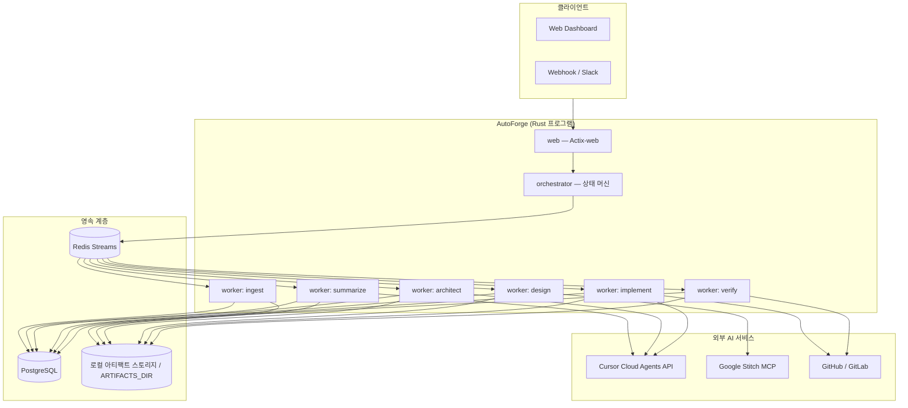

# AutoForge 아키텍처 설계서

## 1. 목표

외주 프로젝트의 **계획서 PDF**를 단일 입력으로 받아, 사람 개입 없이 다음 산출물을 자동 생성한다.

1. 구조화된 요약 (Sonnet)
2. 시스템 아키텍처 + 상세 기획서 (Fable)
3. UI 디자인 에셋 (Stitch)
4. 구현 코드 + PR (Codex 5.3)

**핵심 제약**: Cursor는 TypeScript SDK만 공식 제공 → Rust 오케스트레이터는 **Cursor Cloud Agents REST API v1**을 직접 호출한다. Stitch는 **MCP HTTP 엔드포인트**를 호출한다.

---

## 2. 시스템 컨텍스트



---

## 3. 파이프라인 DAG

순차 의존성과 병렬 가능 구간을 분리해 **극한 효율**을 달성한다.

```
                    ┌─────────┐
                    │ INGEST  │ PDF → raw text + metadata
                    └────┬────┘
                         │
                    ┌────▼────┐
                    │SUMMARIZE│ Sonnet — 구조화 요약 JSON
                    └────┬────┘
                         │
              ┌──────────┴──────────┐
              │                     │
         ┌────▼────┐           ┌────▼────┐
         │ARCHITECT│           │ DESIGN  │  ← 병렬 실행 가능
         │  Fable  │           │ Stitch  │
         └────┬────┘           └────┬────┘
              │                     │
              └──────────┬──────────┘
                         │
                    ┌────▼────┐
                    │IMPLEMENT│ Codex 5.3 — 코드 + PR
                    └────┬────┘
                         │
                    ┌────▼────┐
                    │ VERIFY  │ CI / 테스트 / 린트
                    └────┬────┘
                         │
                    ┌────▼────┐
                    │ DELIVER │ 산출물 패키징 + 알림
                    └─────────┘
```

### 스테이지별 입출력

| Stage | Input Artifact | Output Artifact | Model / Tool |
|-------|----------------|-----------------|--------------|
| `ingest` | `plan.pdf` | `raw_text.md`, `ingest_meta.json` | lopdf + OCR fallback |
| `summarize` | `raw_text.md` | `summary.json` | `claude-4.6-sonnet-high-thinking` |
| `architect` | `summary.json` | `architecture.md`, `spec.md`, `tasks.json` | `claude-fable-5-thinking-high`, `mode: plan` |
| `design` | `summary.json`, `spec.md` | `screens/`, `design_tokens.json` | Stitch MCP |
| `implement` | `architecture.md`, `spec.md`, `screens/` | git branch + PR | `gpt-5.3-codex-high`, `mode: agent` |
| `verify` | PR URL | `verify_report.json` | CI hooks + Codex 재시도 |
| `deliver` | all artifacts | `delivery_bundle.zip` | — |

---

## 프로그램 구조 (단일 바이너리)

```
autoforge/                  # 실행 프로그램 (cargo run)
├── src/
│   ├── main.rs             # CLI — 기본 `serve` (Actix-web)
│   ├── app.rs              # 전역 App 상태
│   ├── config.rs
│   ├── domain/             # StageId, Project, ModelProfile
│   ├── clients/            # cursor.rs, stitch.rs
│   ├── services/           # ingest, orchestrator, worker, pipeline
│   └── web/                # Actix-web routes + handlers
├── static/index.html       # 웹 대시보드
└── migrations/             # PostgreSQL 스키마 (향후)
```

### 4.1 `domain` — 도메인 코어

- `ProjectId`, `RunId`, `StageId` (newtype + UUID)
- `PipelineState` enum (상태 머신)
- `StageEvent` (Redis Streams 직렬화)
- `ModelProfile` — 모델 ID·파라미터 매핑

```rust
pub enum PipelineState {
    Pending,
    Ingesting,
    Summarizing,
    Architecting,
    Designing,
    Implementing,
    Verifying,
    Delivering,
    Completed,
    Failed { stage: StageId, retry_count: u8 },
}
```

### 4.2 `clients/cursor` — Cursor API 래퍼

- `POST /v1/agents` — 에이전트 생성 + 초기 run
- `POST /v1/agents/{id}/runs` — 후속 프롬프트
- `GET /v1/agents/{id}/runs/{runId}` — 상태 폴링
- `GET /v1/agents/{id}/runs/{runId}/stream` — SSE 스트리밍
- `GET /v1/models` — 모델 목록 캐시 (24h TTL)

**효율 패턴**:
- `reqwest::Client` 싱글톤 + HTTP/2 connection pooling
- SSE 스트림은 `bytes::Bytes` zero-copy 파싱
- 동일 repo에 대한 agent는 **재사용** (conversation context 유지)
- `agentId` 클라이언트 지정으로 멱등 생성 (`bc-{project_uuid}`)

### 4.3 `clients/stitch` — Stitch MCP

- Base URL: `https://stitch.googleapis.com/mcp`
- `Project::create()` → `generate(prompt)` → `getHtml()` / `getImage()`
- 디자인 스펙은 `summary.json`의 `ui_requirements` 필드에서 추출

### 4.4 `services/ingest` — PDF 처리

- 1차: `lopdf` 텍스트 추출 (빠름, zero external deps)
- 2차 fallback: 스캔 PDF → 외부 OCR 워커 (Tesseract sidecar, optional)
- SHA-256 해시로 중복 PDF 스킵

### 4.5 `services/artifacts` — 산출물 저장 + 이미지 호스팅

- 로컬 디스크 기반 (`ARTIFACTS_DIR`), Compose/Podman 환경에서는 api/worker/orchestrator가
  공유 볼륨(`artifacts-data`)을 마운트해 파일을 공유한다
- 이미지 호스팅 기능(`/v1/images`, `/media/{filename}`)도 동일한 저장소를 사용한다
- 스테이지 간 전달은 **아티팩트 키/URI 참조만** (메모리에 대용량 복사 금지)
- 여러 호스트로 확장 시에는 NFS 등 네트워크 파일시스템 또는 별도 오브젝트 스토리지 어댑터로 교체 가능

### 4.6 `services/orchestrator` — 상태 머신 + 스케줄러

핵심 설계: **이벤트 소싱 + 낙관적 잠금**

```
PostgreSQL: projects, runs, stage_runs (source of truth)
Redis Streams: stage_commands (work queue, consumer group)
```

상태 전이 규칙:
1. 스테이지 완료 → `StageCompleted` 이벤트 발행
2. Orchestrator가 DAG 의존성 확인 → 다음 스테이지 enqueue
3. `architect` + `design`은 `summarize` 완료 후 **동시 enqueue**
4. `implement`는 `architect` AND `design` 모두 완료 후 시작

**재시도 정책** (exponential backoff):
- Transient API 오류: 3회, 5s → 20s → 80s
- Agent run `FAILED`: 프롬프트 보강 후 1회 재시도
- `verify` 실패: Codex에 `verify_report.json` 첨부 후 재구현 (최대 2회)

### 4.7 `services/worker` + `services/pipeline` — 스테이지 실행

각 worker는 Redis consumer group 멤버. **수평 확장** 가능.

```rust
#[async_trait]
pub trait StageExecutor: Send + Sync {
    fn stage(&self) -> StageId;
    async fn execute(&self, ctx: &StageContext) -> Result<StageOutput>;
}
```

Worker 프로세스는 `STAGE_FILTER` env로 특정 스테이지만 처리 가능 (K8s HPA 대상).

### 4.8 `web` — Actix-web HTTP 서버

| Method | Path | 설명 |
|--------|------|------|
| POST | `/v1/projects` | PDF 업로드 + 파이프라인 시작 |
| GET | `/v1/projects/{id}` | 상태 + 산출물 목록 |
| GET | `/v1/projects/{id}/stream` | SSE 진행률 |
| POST | `/v1/projects/{id}/cancel` | 취소 |
| POST | `/v1/webhooks/cursor` | Cursor webhook (v0 legacy, 준비) |

---

## 5. Cursor Agent 프롬프트 전략

### 5.1 Summarize (Sonnet)

```
System: 당신은 외주 프로젝트 분석가입니다. PDF 계획서를 구조화된 JSON으로 요약하세요.
Output schema: summary.json (strict JSON)
Fields: title, goals[], scope, constraints[], tech_hints[], ui_requirements[], timeline, budget_hint
```

- `mode`: 기본 (agent)
- 컨텍스트: `raw_text.md`를 prompt에 인라인 (128K 이내) 또는 artifact URL

### 5.2 Architect (Fable)

```
System: 시니어 아키텍트 + PM. summary.json 기반으로 기술 아키텍처와 상세 기획을 작성하세요.
Output: architecture.md (C4 + Mermaid), spec.md (유저스토리+AC), tasks.json (구현 태스크 DAG)
```

- `mode`: `plan` (코드 수정 전 계획 수립)
- `customSubagents`: `explore` (코드베이스 탐색, repo 있을 때)

### 5.3 Implement (Codex 5.3)

```
System: tasks.json 순서대로 구현. design/ 폴더의 Stitch HTML을 참고해 UI를 구현하세요.
```

- `mode`: `agent`
- `repos`: 고객 repo 또는 템플릿 repo fork
- `autoCreatePR`: true
- `mcpServers`: Stitch MCP (디자인 에셋 참조)

---

## 6. 효율 최적화 포인트

### 6.1 Rust 런타임

| 기법 | 적용 |
|------|------|
| Tokio multi-thread | worker/API 분리, CPU-bound는 `spawn_blocking` |
| Connection pooling | reqwest, sqlx, redis 단일 pool |
| Zero-copy | `bytes::Bytes`, S3 URI 참조 전달 |
| Release LTO | `lto = "thin"`, `codegen-units = 1` |
| Binary size | `strip = true` |

### 6.2 파이프라인

| 기법 | 효과 |
|------|------|
| architect ∥ design | wall-clock 30~50% 단축 |
| Agent 재사용 | 컨텍스트 재전송 비용 제거 |
| Content-hash dedup | 동일 PDF 재처리 스킵 |
| Stage별 HPA | implement worker만 스케일 아웃 |
| SSE → event bus | 실시간 UI 업데이트, 폴링 제거 |

### 6.3 비용

| 기법 | 효과 |
|------|------|
| Sonnet은 요약만 | 토큰 비용 최소화 |
| Fable은 plan mode | 불필요한 코드 생성 방지 |
| Codex는 tasks.json 단위 | 스코프 제한 |
| 모델 목록 캐시 | `/v1/models` 호출 감소 |

---

## 7. 배포 토폴로지

```
┌──────────────────────────────────────────────┐
│ Kubernetes / Fly.io / Railway                │
│                                              │
│  [api x2]  [orchestrator x1]  [workers xN]   │
│                                              │
│  [PostgreSQL]  [Redis]  [MinIO]              │
└──────────────────────────────────────────────┘
         │                    │
         ▼                    ▼
   Cursor Cloud API     Stitch MCP API
   (VM per agent)       (Google Cloud)
```

- **orchestrator**: 단일 리더 (PostgreSQL advisory lock) — split-brain 방지
- **workers**: stateless, Redis consumer group으로 at-least-once 처리
- **api**: stateless, 로드밸런서 뒤

---

## 8. 보안

- API Key: 환경 변수 / K8s Secret / Vault
- `envVars` (Cursor): repo별 시크릿 주입, 세션 종료 시 삭제
- PDF: 업로드 시 바이러스 스캔 (ClamAV sidecar)
- 고객 repo: fine-grained GitHub token, scope 최소화
- Hook: `.cursor/hooks.json`으로 위험 shell 명령 차단

---

## 9. 관측성

- `tracing` + OpenTelemetry → Datadog / Grafana
- 메트릭: `stage_duration_seconds`, `agent_token_usage`, `pipeline_success_rate`
- 구조화 로그: `project_id`, `stage`, `cursor_run_id` correlation

---

## 10. 실패 모드 & 복구

| 실패 | 대응 |
|------|------|
| PDF 파싱 실패 | OCR fallback → 수동 업로드 요청 |
| Sonnet hallucination | JSON schema validation → 재요청 |
| Fable 스펙 불완전 | AC 누락 감지 → 보완 프롬프트 |
| Stitch 타임아웃 | 5분 timeout → 단순 프롬프트 재시도 |
| Codex 빌드 실패 | verify 단계에서 CI 로그 피드백 루프 |
| Cursor API rate limit | Redis delayed queue + jitter |
