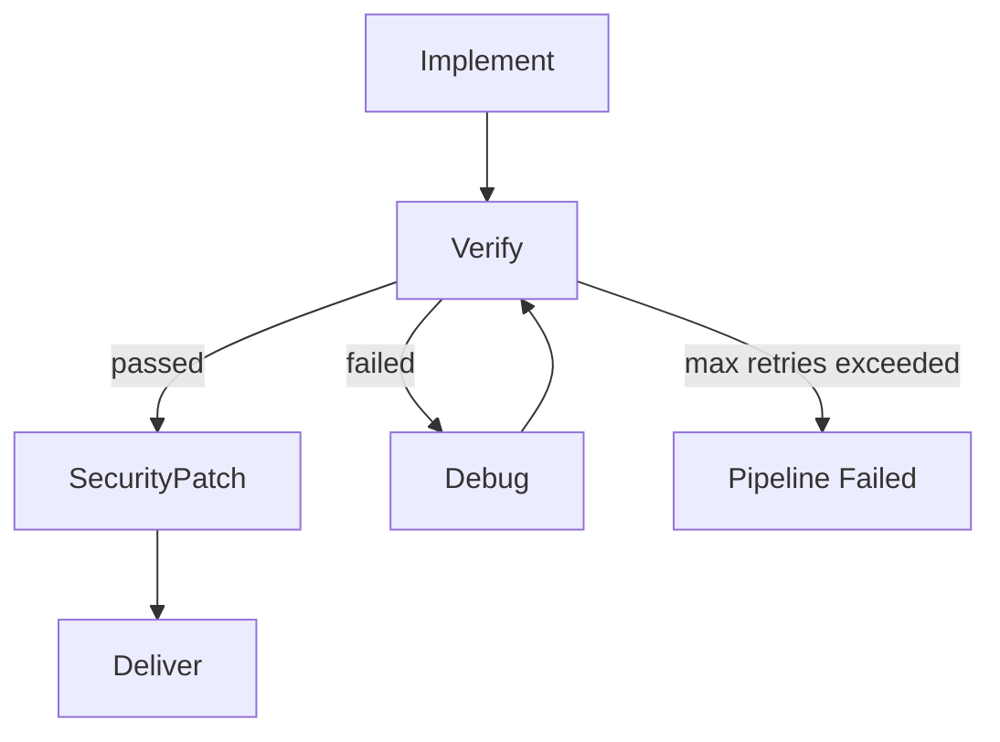

# 품질 게이트 워크플로우

구현 완료 후 **자동 검증 → 디버깅 → 보안 패치**를 수행하는 품질 게이트입니다.

## 파이프라인



## 스테이지 상세

### Verify (자동 검증)

| 항목 | 내용 |
|------|------|
| 모델 | `gpt-5.3-codex-high` |
| 실행 | Cursor Cloud Agent가 repo에서 직접 실행 |
| 검증 명령 | `cargo check`, `cargo test`, `cargo clippy`, `cargo fmt --check` |
| 산출물 | `verify_report.json` |

```json
{
  "passed": true,
  "checks": [{ "name": "cargo test", "passed": true, "output": "..." }],
  "errors": [],
  "summary": "all checks passed"
}
```

### Debug (자동 디버깅)

| 항목 | 내용 |
|------|------|
| 모델 | `gpt-5.3-codex-high` |
| 트리거 | Verify `passed: false` |
| 동작 | 실패 테스트/린트 오류 분석 → 최소 수정 → 재검증 |
| 재시도 | `MAX_DEBUG_CYCLES` (기본 3) |
| 산출물 | `debug_report.json` |

### SecurityPatch (보안 패치)

| 항목 | 내용 |
|------|------|
| 모델 | `claude-fable-5-thinking-high` |
| 트리거 | Verify 통과 후 |
| 검사 | `cargo audit`, OWASP Top 10, 시크릿 스캔 |
| 동작 | 취약 의존성 업데이트, 코드 취약점 수정 |
| 산출물 | `security_report.json` |

```json
{
  "passed": true,
  "vulnerabilities_found": 2,
  "patches_applied": [
    { "id": "RUSTSEC-2024-0001", "severity": "high", "package": "openssl", "action": "upgraded to 0.10.70" }
  ],
  "audit_tools": ["cargo audit"],
  "summary": "2 vulnerabilities patched"
}
```

### Deliver

모든 산출물 URI와 스테이지 메타데이터를 `delivery_manifest.json`으로 패키징합니다.

## 설정

```bash
MAX_DEBUG_CYCLES=3   # Verify 실패 시 Debug 최대 횟수
```

## 실패 처리

| 상황 | 동작 |
|------|------|
| Verify 실패 + Debug 여유 있음 | Debug → Verify 재실행 |
| Verify 실패 + Debug 횟수 초과 | 파이프라인 `Failed`, 프로젝트 상태 `failed` |
| SecurityPatch 실패 | 파이프라인 `Failed` |
| 스테이지 실행 오류 | 즉시 `Failed` |
