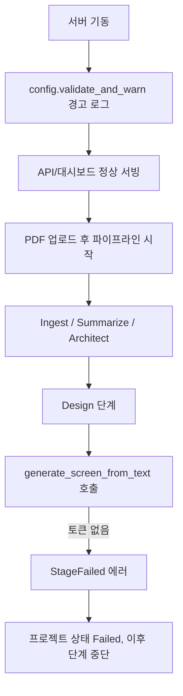

# STITCH_ACCESS_TOKEN 없을 때 동작

## 역할 구분

Stitch 인증은 **두 가지**로 나뉩니다 (`.env.example`, `backend/src/clients/stitch.rs`):

| 변수 | 용도 |
|------|------|
| `STITCH_API_KEY` | MCP 연결, `create_project`, `get_screen`, `tools/list` 등 |
| `STITCH_ACCESS_TOKEN` | OAuth Bearer — **AI 화면 생성** (`generate_screen_from_text`, `edit_screens`, `generate_variants`) |

API 키만으로는 화면 **생성**이 불가하고, Bearer 토큰이 별도로 필요합니다.

**중요:** Stitch MCP는 `X-Goog-Api-Key`와 `Authorization: Bearer`를 **동시에**내면 401을 반환합니다.
(`API key for authentication is used with other authentication credentials`)
AutoForge는 호출 종류에 따라 둘 중 하나만 전송합니다 — 생성 도구는 Bearer만, 그 외는 API 키만.

## 시나리오별 동작



### 1) `STITCH_API_KEY`만 있고 `STITCH_ACCESS_TOKEN` 없음 (가장 흔한 케이스)

- **서버**: 정상 기동 (크래시 없음)
- **시작 시 로그** (`backend/src/config.rs`):
  > `STITCH_ACCESS_TOKEN is not set — Stitch API key alone cannot run generate_screen`
- **`/ready` 헬스체크** (`backend/src/services/health.rs`, `stitch.rs`):
  - `tools/list`는 API 키로 통과할 수 있음
  - 그러나 `health_check()`는 access token 없으면 **error → degraded** 처리
  - 메시지: `Design stage will fail on generate_screen`
- **Design 단계** (`backend/src/services/worker.rs`):
  1. `ensure_project` (`create_project`) — API 키만으로 **성공 가능**
  2. `generate_screen` — **즉시 실패**, 에러 메시지:
     ```
     STITCH_ACCESS_TOKEN is required for Stitch screen generation — API key alone is insufficient.
     Run: gcloud auth application-default login && gcloud auth application-default print-access-token
     ```
- **파이프라인**: Design이 `Failed` → 프로젝트 `PipelineState::Failed` (`backend/src/services/pipeline/engine.rs`). **Implement 이후 단계는 실행되지 않음**. Slack 알림 설정 시 실패 알림 전송.

### 2) `STITCH_API_KEY`와 `STITCH_ACCESS_TOKEN` 둘 다 없음

- 시작 시: `STITCH_API_KEY / STITCH_ACCESS_TOKEN not set — Design stage will fail`
- `/ready`: `stitch_api` 체크 **skipped** (아예 프로브 안 함)
- Design 단계 첫 Stitch 호출에서 즉시 실패: `STITCH_API_KEY or STITCH_ACCESS_TOKEN is not configured`

### 3) `STITCH_ACCESS_TOKEN`만 있고 `STITCH_API_KEY` 없음

- 코드상 `has_credentials()`는 통과 (둘 중 하나만 있어도 됨)
- 실제 Google API 동작은 API 키 없이 Bearer만으로 제한될 수 있음 — 운영 시 **둘 다 설정**을 권장

## 영향 받지 않는 기능

- REST API, 대시보드, 이미지 호스팅
- Summarize / Architect / Ingest 등 **Design 이전** 단계 (단, `CURSOR_API_KEY`는 별도 필요)
- `/health` liveness

## 토큰 발급 및 자동 갱신

AutoForge는 Design 단계 호출 시 Bearer 토큰을 **자동으로 갱신**합니다.

우선순위:

1. `GOOGLE_APPLICATION_CREDENTIALS` 또는 `~/.config/gcloud/application_default_credentials.json` (ADC)
2. `gcloud auth application-default print-access-token` (gcloud CLI)
3. `.env`의 `STITCH_ACCESS_TOKEN` (정적, 만료 시 401 후 ADC/gcloud로 재시도)

로컬 개발 (권장):

```bash
gcloud auth application-default login
gcloud config set project YOUR_PROJECT_ID
# .env 에서 만료된 STITCH_ACCESS_TOKEN 행은 삭제하거나 비워 두세요
```

GCP 콘솔에서 Stitch MCP API 활성화 및 IAM (계정에 아래 역할 부여):

```bash
gcloud beta services mcp enable stitch.googleapis.com --project=YOUR_PROJECT_ID
gcloud projects add-iam-policy-binding YOUR_PROJECT_ID \
  --member="user:YOUR_EMAIL" \
  --role="roles/serviceusage.serviceUsageConsumer"
```

서비스 계정 (Docker/운영):

```bash
# .env
GOOGLE_APPLICATION_CREDENTIALS=/run/secrets/gcp-adc.json
GOOGLE_CLOUD_PROJECT=my-project-id
```

Compose 예시 — ADC JSON을 컨테이너에 마운트:

```yaml
volumes:
  - ${GOOGLE_APPLICATION_CREDENTIALS}:/run/secrets/gcp-adc.json:ro
environment:
  GOOGLE_APPLICATION_CREDENTIALS: /run/secrets/gcp-adc.json
```

- `authorized_user` ADC: refresh_token으로 자동 갱신
- `service_account` JSON: JWT로 자동 갱신
- 캐시는 만료 5분 전에 선제 갱신, 401 시 1회 재시도

## 요약

| 항목 | 토큰 없을 때 |
|------|-------------|
| 서버 기동 | 가능 |
| 업로드/목록 API | 가능 |
| Design 단계 | **실패** |
| Implement 이후 | **실행 안 됨** |
| `/ready` stitch 체크 | degraded 또는 skipped |

Design 단계를 쓰려면 `STITCH_ACCESS_TOKEN` 설정이 **필수**입니다.
